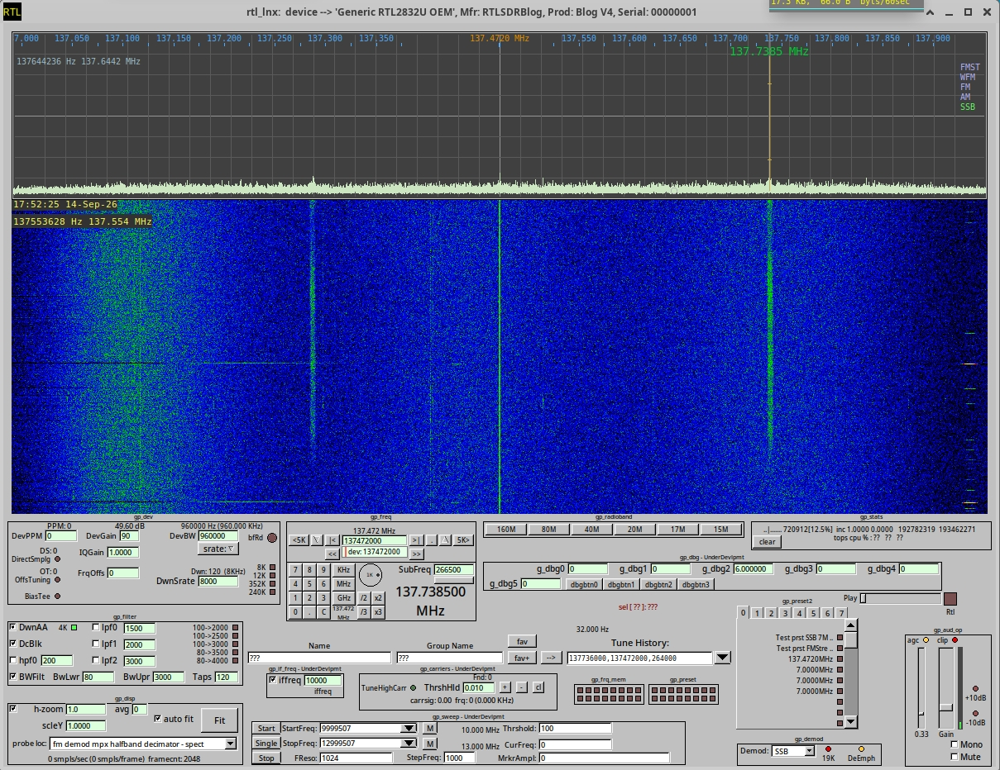
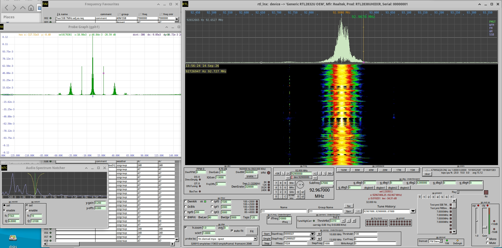

Jul-2026, v1.06

## rtl_lnx - SDR app for Linux

## Purpose
Basic software defined radio gui app for linux with waterfall feature. Works with economical rtl-sdr usb dongles commonly used for terrestrial digital TV reception (DVB-T).

## Intro
Rtl based dongles are effectively wideband zero I/F radio receivers, they downconvert (tune) a frequency of interest to around 0Hz and give you an I/Q data stream with a bandwidth that's user adjustable. In this bandwidth there can be many radio signals to be further tuned in to using SDR software like this app. SDR's use digital signal processing methods to filter out and demodulate the signal of interest.

If you already have a cheap dongle based on RTL2832U ADC and it has a frontend tuner ic onboard like an R820, it'll be good for VHF/UHF only as is, but that will certainly whet your appetite.

Reception is only as good as your aerial.

If you are near an airport - an outdoor TV antenna can give you good results for airband (VHF). TV antennas also are good for the 144MHz amateur FM band. The NOAA sats at 137MHz are now decommissioned, another possibility is the ORBCOMM sats at similar freq, you would only see the modulated carrier when sat comes in range, this app does not have decoders for sats.

With an RTL Blog v4 dongle (oh: the v4 may no longer be avail) and a long wire aerial, you should be able to receive international shortwave AM bands(depending on time of day and aether conditions), amateur ham radio (usually SSB) can also be heard, some of the more powerful amateurs half a world away are also receivable. Unfortunately strong AM commercial radio stations nearby can swamp the lower shortwave frequencies.

RTL Blog v4 dongles require the correct driver installed on your system, else you won't have access to its additional circuitry. If you decide to buy one of these, only buy it from their recommended suppliers, the numerous cheap clone copies do not have the same circuitry and usually do not work at all, or have poor performance for AM/shortwave.

Your system may automatically set a newly inserted dongle for use by linux modules such as 'dvb_usb_rtl28xxu' etc, you need blacklist and 'rmmod' these modules to gain access to the dongle. This app will show a dongle is busy on start up if dongle is in use, this will happen if dvb modules have grabbed a dongle.

## Code
The app was developed with GNU C on PuppyLinux 32 bit, then moved to Ubuntu 64 bit.
The code has had many additions over numerous years, it's rather experimental, messy and carries much breadboard baggage, some of which is now disabled. There are built-in ficticious radio channels that can be tuned in to (when no dongle is connected), this helps with code development. The code is heavy on commenting, some of which is possibly incorrect due to lengthy period of development. 

I've tried to reduce library dependencies as much as possible to allow easier compilation, the downside of this is the code is not very efficient.

The code has not been tested Wayland, but from what I've read fltk-1.5 supports Wayland, so if it does not work it may not be a major undertaking to support it, I have removed some old X11 calls which were not essential.

Gui controls are mostly organised into labelled groups, such as 'gp_filter', those in development or no longer operational are marked as 'UnderDevlpmt'. The groups have their borders showing and are positioned in an ad hoc fashion so the gui is somewhat ugly.

Set boolean 'b_use_synthesis_dont_use_rtl_dev' to '1' to stop probing of rtl dongles on startup, helps when moding/debugging code (in file: rtl_graph.cpp).
  
Set boolean 'b_fast_start_no_voice_files' to '1' to speed app startup, this removes the fictitious voice channels, handy when doing a mod/test code cycle (in file: rtl_graph.cpp).

I'm not much of a radio operator, this project was much about learning DSP techniques, it's crept into a radio, some controls and features may not make sense or be cumbersome to experienced operators, would recommend you also seek out other SDR programs which have much nicer gui, graphs, features and performance if you are going to spend some time listening.

There is a gui thread (main), rtl driver thread, and an audio thread.

The fm stereo decoder (a recent addition), is simplistic in design and performance, chatgpt did this code's framework.

Some of the code is re-purposed from other projects I've concocted over the years, so excuse the antiquated c style, evolving conventions, inefficiencies and dubious fit.

Some ideas and code are adopted from: https://github.com/osmocom/rtl-sdr

Where pieces of code or ideas originate from other people or projects, there will be comments/links in source code to who or where it came from. 

See more info at:  
https://osmocom.org/projects/rtl-sdr/wiki/Rtl-sdr
https://www.rtl-sdr.com/

## Build
Requires: rtlsdr, fftw3, RTAudio v6.01, and FLTK libraries for linking, fltk-1.3.8 or fltk-1.5 will work.

Point Makefile 'LIBS' and 'INCLUDE' to your system setup

Have not tested on Wayland but fltk-1.5 supports it, see Code section above also.

To build executable, type: make

No installation is required.

Turn down you audio gain as this app can drive levels to the MAX.

If it built without error, run: './rtl_lnx' from a folder where permissions for execution have been enabled, the app will read/create a 'rtl_lnx.ini' settings file in same folder.

No SIMD is explicitly coded and no provisions is made to help the compiler with vectorisation, however it's best to leave the compiler optimiser set to max in your final build for more efficient dsp execution (as already defined in makefile).

If you make significant code changes, you may need to do an occasional 'make clean', this can help clear out old '.obj' files as the makefile may not be thorough, otherwise you may get some strange bugs, even though code is correct.

## Usage
Take precautions to keep your audio at safe levels, this app can drive signals to the EXTREME with pops, clicks and white noise.

Move mouse to top left to show menu bar.

Edit/Preference menu holds various settings, Note: some settings such as zero padding can significantly burden the cpu.

Hover over gui controls to see a hint at what they do.

Select a dongle sample-rate to use (DevBW), try 1920000 (1.92MHz). This is the adc sample-rate of the dongle, higher allows you to see more spectrum at once, but drives the dsp/display code harder and increases your processor usage. Changing DevBW will also adj DwnSrate to keep it an integer factor. Note: some DevBW srates available are not practical and will cause audio stuttering if they a too low or too high. Adj for what works best on your system. 

Select the demodulator to use, presently: AM, SSB(for USB and LSB), FM, FM Stereo are supported, (WFM is the same a FM at present).

Select a downsampler o/p srate with DwnSrate, try 12000 for AM and shortwave/SSB  (the srate will be set to a nearby integer factor of DevBW).

Set downsampler antialias filter (DwnAA) to about half your downsampler srate.

FM stereo: click on the 19K led for auto setup. Or tediously: set DevBW to 960000, also need modest downsampling, (high downsampler o/p srate, so a low downsample factor, try 320KHz for DwnSrate). Turn off all the filters, agc off, clipper off, and select DeEmphasis for your region to restore EQ, disable Mono. Adjust DevGain to suit, have found noise increases with high device gain (in my location in any case). The 19K led should go green showing PLL is locked which is req for correct stereo decoding. The FM Stereo performance is not the best due to the simple implementation.

Setting a frequency to tune: put mouse within inset graph, hit 'enter' key to see current freq on graph (quickly hitting 'enter' again will clear freq), type in a freq then hit keybrd 'k', 'm' or 'g' such as 80.1m for 80.1 MHz (alternatively, within gui keypad area, you can type in a freq then hit keybrd 'k', 'm' or 'g', you can zero SubFreq with nearby button also). This sets the dongle's onboard tuner freq (OBT). This frequency is the center of the graph (when you are not h-zoomed in). Right click drag will change the onboard tuner freq.

When you see a carrier appear on graph, left click on it to change sub tuning (SubFreq) to that carrier, sub tuning does not change onboard tuner freq. 
Left click dragging changes the sub tuning, this is useful if you are h-zoomed in. Sub tuning can be tweeked with mousewheel when mouse is over this graph, if mouse is in lower half of graph the mousewheel gives coarser freq adj (there are 2 markers on tuning needle showing where the tuning coarseness changes, see also in Prefs menu for coarseness settings).

Adj filters to clean up reception for AM/SSB.

Hit space bar to drop a pin/thumbtack (circle) at current tuned freq, clicking pins allows quick jumping between tunings, the cursor left/right keys allow cycling through pins while mouse is within graph (hit Home key to center if you can't see the current tuned pin). Right clicking on a pin will modify it to make it center on graph when recalled (by adjusting pin's onboard tuner freq value and zeroing its SubFreq value).

The y scale of the graph is not calibrated to a reference. 

Move the mouse to near the bottom of the graph and a blue bar will appear, changing the mousewheel while the bar is visible will adjust h-zoom. There are no scroll bars. h-zoom will expand and contract from where the mouse pointer is positioned.

The waterfall display gives you a history of recent carrier appearances and is also clickable. 

If you wish to listen to lower side band (LSB) or upper sideband (USB) and have a dongle that supports HF, select SSB. Because no distinct fixed carrier exists for SSB (unlike what you find with AM), you need to adjust sub tuning (SubFreq) with mousewheel to place tuning needle at best freq to reduce audio pitch shifts. Lower side band needs the tuning needle to be right of the spectrum you want to listen to, upper sideband needs to be left of the spectrum. The spectrum I mention is the sideband signal which is just the audio modulation signal sitting at the carrier's freq, the spectrum is as wide as the audio bandwidth, the carrier is not present, just the sideband, if the audio mod. signal goes silent you will see nothing on graph. You can turn on the built in test signal sythesiser in Device menu (Synth IQ samples - tune 0Hz), there you can set a signal to use LwrSB or UprSB modulation.

There are square preset leds to quickly save and recall tunings (some presets are in a tabbed wnd, these show labels which you can set using the 'Name' text box). The presets are saved on exit and are persistent. Note the 'gp_frq_mem' leds only store the freq (rather than all the current settings, all other grouped preset leds do store most of current settings).

Create favourites for long term storage using Fav+ button (max of 256), hit Fav button to see Fav window, right clicking one of the left most leds in Fav wnd will store current tuning as well, make sure favourite has a Name, unnamed Favs are considered an avail slot. Save favs using menu before you exit, otherwise they won't be loaded on restart (a backup copy is saved on exit as 'zzz_fav_save_on_exit.txt' to allow recovery of the last unsaved favourites list).

If you use the raw IQ record/play feature, each I and Q sample straight out of the dongle is promoted to 24 bit float type (from rtl's 8 bit reso), so file will grow quickly depending on your selected DevBW setting. When playing back you need to set the same DevBW otherwise you will get ChipMonk/Slo-Mo demodulated audio. The rec file holds only the raw I/Q float samples, there is no formatting, so no indication of what samplerate(DevBW) it was recorded with or rtl's onboard tuner freq used, best to add an srate and tuner freq to filename. The recorded file contains a piece of spectrum centered at the onboard tuner freq you had set while in record, so you can only sub tune within this spectrum when playing file. If you changed onboard tuner freq while in record you will record a different section of spectrum.

## Graphs
The main inset graph (mentioned earlier) shows your frequency span. This graph can be set to integrate over time (using 'avg') and thus reduce spectral display fluctuations, but comes at the cost of slower display response. It can help reveal hard to spot low level carriers amongst the noise, however if they are hard to spot you most likely won't be able to demodulate them in any case.

There is a monitoring graph (Probe Graph) which allows probing of various locations in the SDR chain. Some locations are shown in the time domain, others in the freq domain, it was most useful for developing this app. The graph can display large amounts of data if you have a high device bandwidth(DevBW) and monitor before any downsamplers, this will cause excessive cpu utilisation, closing the graph wnd when your not using it will free up the cpu. Press 'Fit' button to reshow it or to rescale its trace to fit wnd (also, while hovering mouse the over this button and spinning the mousewheel allows you to change y axis scale). If a triangle waveform or no trace is shown, it likely indicates there was no signal to display, this will occur if the probe location is in a part of the chain that is not curently in use. Press 'h' key on this graph to see some other options. Note: spectral plots will wrap at nyquist of DwnSrate/2 (or DwnSrate/4 for FM Stereo when monitoring after the fm stereo halfband decimator).

The Audio Spectrum Notcher graph allows you to click on relatively stationary whir/whistle noise, this will notch out that particular freq region, useful for AM/SSB. There are 2 notch filters avail, the mousewheel offers further adjustment of notch freq, move mouse towards top of graph and mousewheel will then adj filter's Q changing the sharpness of the notch. The graph is updated infrequently and may be further downsampled dependent on your DwnSrate setting, it integrates over time to reveal stationary spectra, this graph only shows the lower audio freqs. 

## Keyboard
'Enter' key in rapid succession to clear freq keyin register (with mouse sitting over graph), type in a freq, use 'k', 'm' or 'g' to complete or a single 'Enter' key press to complete.  

'Home' key to center onboard tuner to current tuning (SubFreq is zeroed).  
Keypad '/'	h-zoom in, coarse.  
Keypad '*'	h-zoom out, coarse.  

Keypad '-'	h-zoom in, fine.  
Keypad '+'	h-zoom out, fine.  

'Space Bar' to drop a pin.  
'Cursor Left' select prev pin.  
'Cursor R' select next pin.  
Right clicking will modify a pin so it will center it on graph when selected.    

'Ctrl' key and mousewheel adj h-zoom of inset graph  
'Shift' key and mousewheel adj y scale of inset graph  

h-zoom: move mouse to lower part of graph to show blue bar, then spin mousewheel.  
Audio Notcher: move mouse to upper part of graph to show red bar, then spin mousewheel to adj filter Q.    

